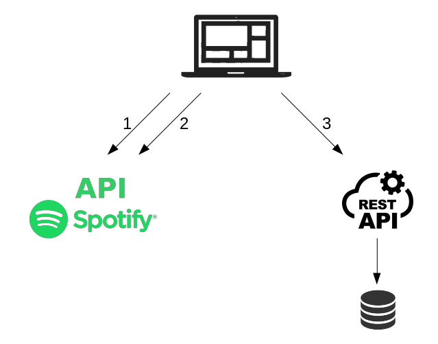
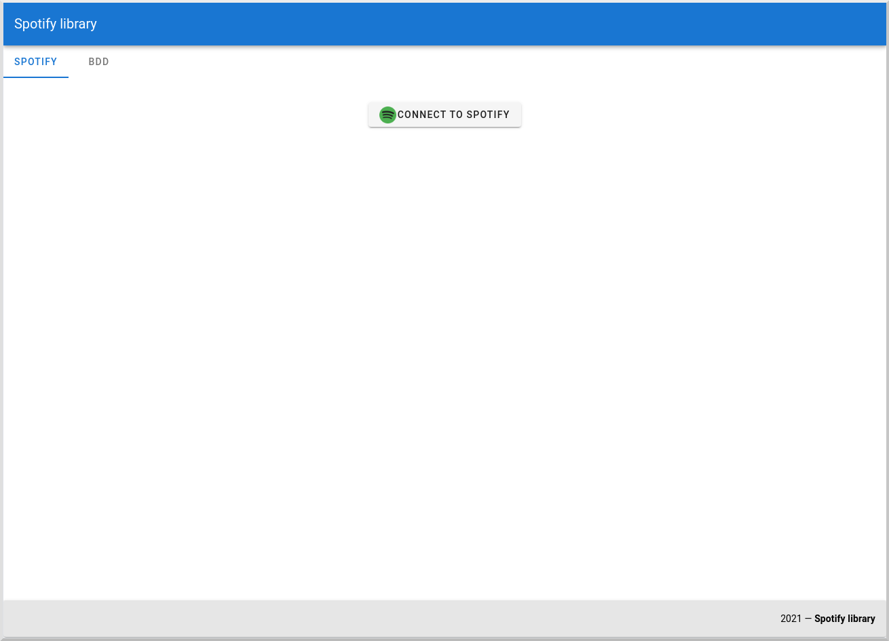
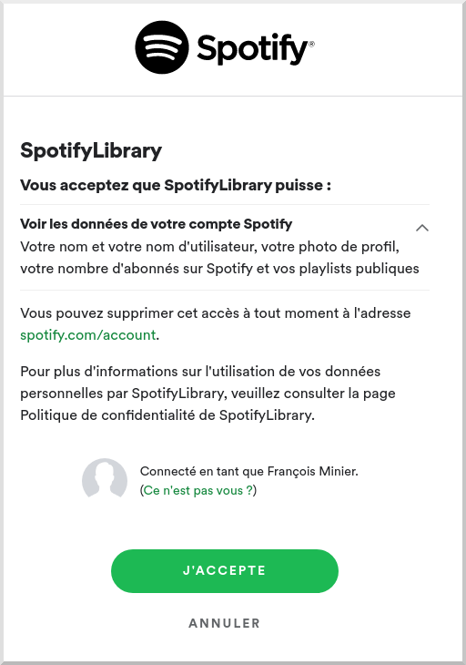
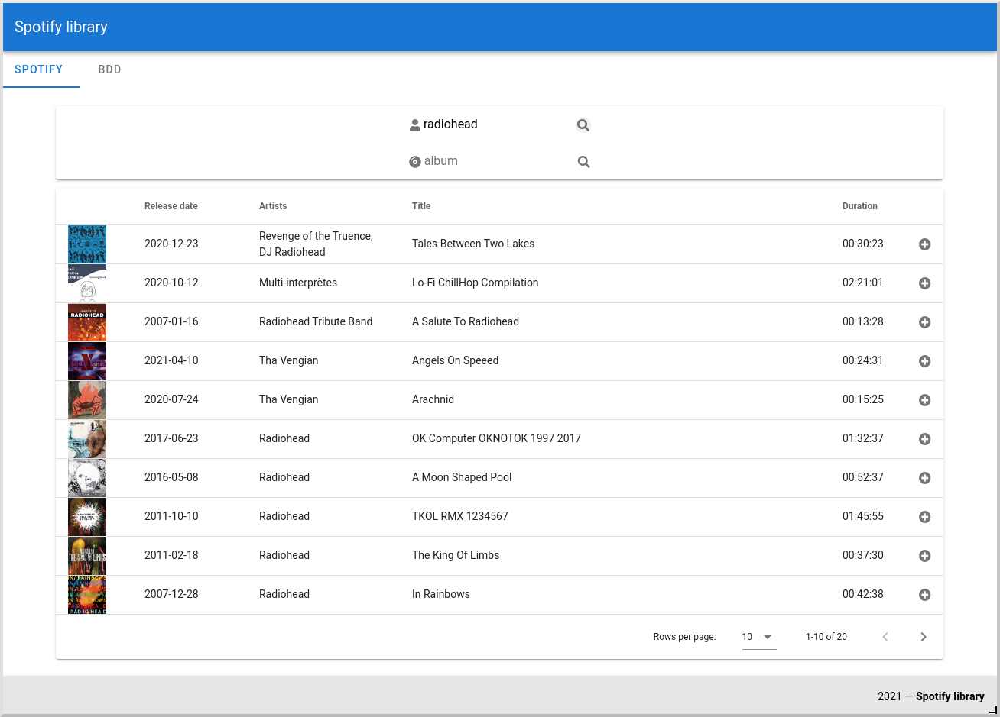
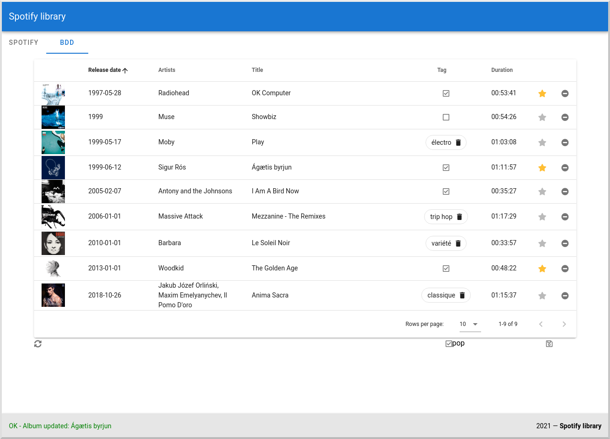

# spotify-library

# Table of contents
1. [Spécification](#spécification)
2. [Conception](#conception)
3. [Screenshots](#screenshots)
4. [Installation](#installation)
5. [Pour aller plus loin](#pour-aller-plus-loin)

## Spécification
Développez les fonctionnalités suivantes dans la technologie web cible en utilisant l’open API de
Spotify. Votre temps est précieux, fixez vous un temps limite à y consacrer. Vous ne serez pas jugés sur
la complétude du périmètre et vous aurez toujours l’occasion d’expliquer lors du débriefing comment
vous auriez poursuivi, terminé, voire refactoré votre projet !

### 1er Ecran
**Recherche albums/artistes**  
Rechercher un album à partir du nom de l’album ou du nom de l'artiste et afficher la liste des résultats
(les albums et ceux de l’artiste retourné par la recherche)  
● Afficher seulement le titre, la vignette, la date de sortie et la durée de chaque album  
● Afficher les 20 premiers résultats uniquement  
● Permettre d’ajouter un album de la liste des résultats dans la bibliothèque (une liste propre à
l’application et non la bibliothèque de l’utilisateur Spotify ! … )  

### 2eme Ecran
**Gérer sa bibliothèque d’albums uniquement**  
● Ajout d’un nouvel album via renvoi vers la recherche et suppression d’un album de la liste  
● Pouvoir définir pour un album donné que celui-ci est un album favori parmi ceux de la
bibliothèque  
● Appliquer un tag (saisie libre à un ou plusieurs albums à la fois)  

### Ressources  
https://developer.spotify.com/  
https://developer.spotify.com/console  
  
Exemples:  
https://open.spotify.com/artist/6NB0vY1HQgkUpCBsm5eAvo  
https://open.spotify.com/album/5q16e7zsJTzJs3hWPNoobE  

## Conception

  
_1: `spotify-library-ihm` s'authentifie à Spotify et récupère un token_  
_2: `spotify-library-ihm` utilise l'API Rest Spotify à l'aide du token pour rechercher des albums et les afficher_  
_3: `spotify-library-ihm` utilise l'API Rest `spotify-library-server` pour lire/écrire dans notre bibliothèque utilisateur_

## Screenshots

_Ecran d'acceuil qui invite à une connexion à Spotify_  
  

_Ecran de connexion à Spotify_  
  

_Ecran de recherche d'albums via l'API Spotify_  
  

_Ecran de gestion de notre discothèque_  
  

## Installation

**WARNING**  

L'application est configuré de la sorte :
- Les propriétés d'accès à Spotify sont portées par le projet `spotify-library-ihm` :  
  - clientId : "9356dbb5ddb046979447e2b2e84d6d04"
  - secret : "c445b6a4413d401d9d9e098911d4bf12"
  - redirectUri : "http://localhost:8888/callback"
- `spotify-library-server` tourne sur http://localhost:8080  
- `spotify-library-ihm` tourne sur http://localhost:8888  

_Pour un changement de configuration, se référer aux docs d'installation ci-dessous :_  

**Installer et lancer le backend** :  [README.md `spotify-library-server`](spotify-library-server#readme)  
**Installer et lancer le frontend** :  [README.md `spotify-library-ihm`](spotify-library-ihm#readme)  

## Pour aller plus loin...

● Gérer un journal des modifications  
● Ajouter une authentification à notre bibliothèque : se connecter par login/pwd  
...
  
  
Pour la partie `spotify-library-server`:  
● TU/TI    
● Ajouter une BDD gérée par Flyway  
● Gérer le pb Lombock  
● Avoir une bibliothèque par utilisateur de l'IHM authentifié  
...
  
  
Pour la partie `spotify-library-ihm`:  
● Mutualiser les composants "Liste d'albums"  
● Les 2 listes `spotifyAlbums` et `serverAlbums` ne doivent pas être stockés dans le store _(=> cf. `DisplayTag` gestion par props + event)_  
● Les feedbacks ne doivent pas être stockés dans le store _(=> Remonter les feedbacks par event)_  
● TU  
● Internationalisation (I18n)    
● Ajouter un filtre pour la liste des albums de notre BDD  
● Suivre le flow d'authentification Spotify pour manipuler un refresh_token  
● Se déconnecter au compte Spotify  
● Améliorer le style (notemment les formulaires de saisie, les boutons)  
● Usage de thème pour notamment proposer un dark-mode   
...
