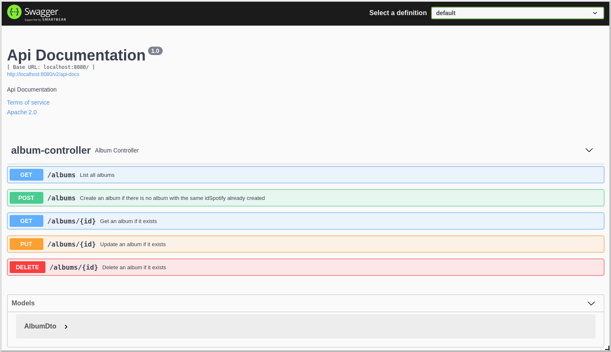

# spotify-library-server

# Table of contents
1. [Installation](#installation)
2. [Démarrage](#démarrage)
3. [URLs de l'application](#urls)
4. [Frameworks utilisés ](#frameworks-utilisés)

## Installation

```bash
$ git clone https://github.com/fanch35000/spotify-library.git
$ cd spotify-library-server
$ mvn install
```

## Démarrage
```bash
$ mvn spring-boot:run
```

## URLs
http://localhost:8080/

http://localhost:8080/swagger-ui/  



## Frameworks utilisés
| Nom               | Besoin                                              | Lien |
| ----------------- | --------------------------------------------------- | ---- |
| Springboot        |                                                     | https://spring.io/projects/spring-boot |
| Swagger-ui        | Exposer une doc des services REST                   | https://swagger.io/tools/swagger-ui/ |
| Mapstruct         | Mapper Entity-DTO                                   | https://mapstruct.org/ |
| h2database        | BDD                                                 | https://www.h2database.com/html/main.html |
| Lombok            | Gestion des Accesseurs/Constructeurs par annotation | https://projectlombok.org/ |
